# Klassen

Klasse
: A class describes a set of objects that share the same specifications of features, constraints and semantics.

## Notation

Eine Klasse wird durch ein Rechteck mit durchgezogener Line dargestellt, der Name der Klasse steht in **Fettdruck** und mittig innerhalb des Rechtecks
und
beginnt mit einem Grossbuchstaben.

Der Name einer abstrakten Klasse wird _**kursiv**_ geschrieben.

```plantuml
@startuml
left to right direction

class Account { }
@enduml
```



````C#
class Account { }
````